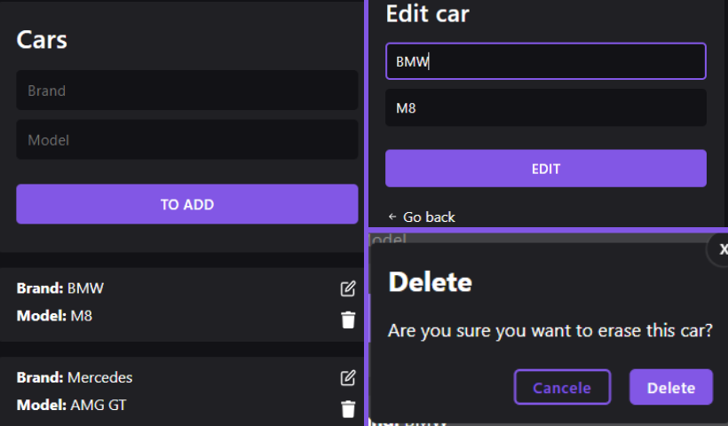

## Explicando o projeto

#### Imagem do projeto final

##

### Sobre

Esse projeto foi desenvolvido para você adicionar qualquer carro(marca e modelo), deletar e atualizar. <i>Desenvolvido por fins de estudos.</i>

### Tecnologias que foram usadas

  
  
   
  

### Banco de dados

  

##

#### Desenvolvido por Pedro Souza 
